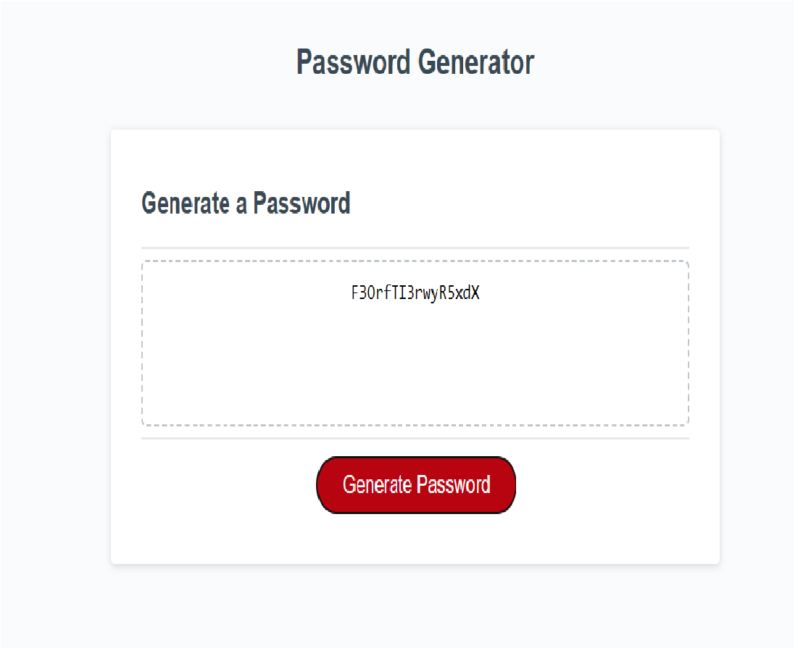

# Unit 5 Challenge: Password generator

## Overview

In this project, based on user input a random password will be generated

## Project Details
In this application user will be given the options to select the length of the password and it should be between 10 and 64. User has options to choose between lowercase, uppercase, numbers and special characters. User must choose atleast one of the character values to generate the password.
Based on the user input a random password will be generated. The output is displayed in the screen. 

## Installation

N/A

## License

Please refer to the license in the repo

## Credits

* https://developer.mozilla.org/en-US/docs/Web/JavaScript/Reference/Global_Objects/Math/random

* https://www.w3schools.com/js/js_object_methods.asp

## Deployed github link

* 

* 
